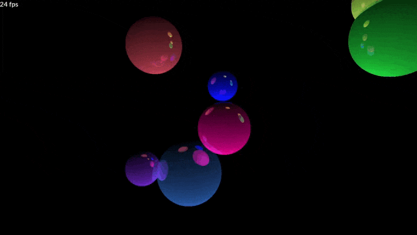

# Sunshine Ray Tracer

Inspired by: <https://www.scratchapixel.com/code.php?id=8>

## Setup

Based on <https://github.com/rewrking/sfml-vscode-boilerplate/> for SFML.
Setup as explained in their repo.

F9 in VScode to build and run "Release" once setup.

## Project

I'm using this hobby project to refresh my C++ skills.

Here is an example of 1280 x 720 pixels (921600 rays), 8 spheres, two light sources and up to 5 reflections per ray.
Rendered on the CPU using 8 (c++) threads. Without screen recording this runs at 24+ fps on my machine.

